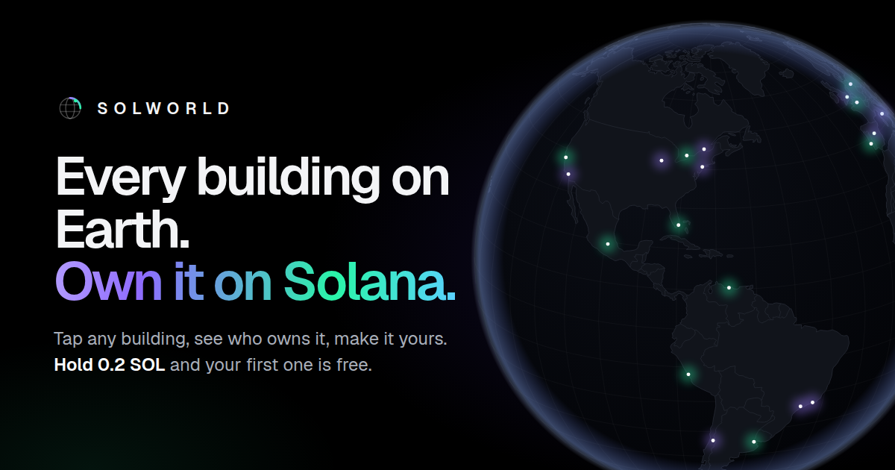

# Solworld

**Every building on Earth. Own it on Solana.**

Solworld is a black, Tesla-style 3D map of the whole planet where every building is clickable. Tap one to see what it looks like (a satellite close-up, a real photo when there is one, and a Street View link) and who owns it. You can buy it with SOL, take it with meme-coin credit, sell it to whoever makes the best offer, and put your own glowing billboard on it.



- **The whole world:** hundreds of millions of OpenStreetMap buildings on a spinning globe, extruded in 3D. Up close, buildings get lit windows and the ground switches to real satellite imagery.
- **A wallet for everyone:** each visitor gets their own Solworld wallet, created in their browser. They deposit SOL to it (QR code, address, or straight from Phantom) and every action after that is one tap, with no wallet pop-ups.
- **Real ownership:** every action is a Solana transaction. There is no database and no server, so anyone can verify who owns what.
- **Instant to host:** it's a static website with nothing to build or install.

---

## Go live

### 1. `solworld/config.js`

Your wallet is already in place:

```js
treasury: "8tiwEgFFPdkMRhPMZtxHRwvopwf1PeqzgMpVMq7GKkpV",
```

Every building purchase, and 5% of every resale between players (`marketFeePercent`), is paid straight to this wallet.

> **Never put a private key or seed phrase in this file.** Everyone can read it. Solworld refuses to start if it spots a private key there.

Set `treasury: ""` to run in **demo mode**, where everything works but nothing real moves.

### 2. When your meme coin launches: enter it on the site

No code editing needed. Open your site at **`/#/operator`** (or **How it works → Operator tools**) and fill in **Your meme coin**:

- **Token mint:** the coin's mint address from pump.fun or your launch page.
- **Ticker:** for example `SOLW`.
- **Value of 1,000,000 tokens (in SOL):** tap **Use current market price** to fill it in from DexScreener, or type your own number.

Then tap **Save coin** and approve in Phantom with your treasury wallet (`8tiw…KpV`). No SOL moves; the setting is saved on Solana, so every visitor gets it instantly without a redeploy. To change the price later, update it the same way. New prices apply from that moment, and earlier purchases keep the price they had.

After that, holders tap **Buy with my $TICKER holdings** on any building (or **Wallet → Use your $TICKER**), paste the wallet that holds the coin, and approve **one signature** with it. The signature proves the wallet is theirs and moves nothing. The coins' value becomes building credit. For example, coins worth 0.56 SOL give 0.56 SOL of buildings, and credit can't be spent twice.

The `memecoin` block in `config.js` still works as an alternative, but the on-site setting is easier.

### 3. Deploy (pick one)

**Netlify (recommended):** at [app.netlify.com](https://app.netlify.com), go to **Add new site → Import an existing project → GitHub**, pick this repository and branch, then click **Deploy**. [`netlify.toml`](netlify.toml) already publishes the `solworld` folder.

**Netlify Drop (no GitHub):** download this repo as a ZIP, unzip it, and drag the `solworld` folder onto [app.netlify.com/drop](https://app.netlify.com/drop).

**Vercel:** import the repository at [vercel.com/new](https://vercel.com/new). [`vercel.json`](vercel.json) is already set up.

**Anywhere else:** upload the contents of `solworld/` to any static host that serves over HTTPS.

### 4. Before real traffic (recommended)

The free public Solana RPC is rate-limited. Add your own endpoint in `config.js`; a free [Helius](https://helius.dev) key is plenty to start:

```js
rpc: ["https://mainnet.helius-rpc.com/?api-key=YOUR_KEY"],
```

---

## How it works

### Prices: 0.001 to 3 SOL

Prices are automatic and deterministic, computed from public OpenStreetMap data, so anyone can re-check them. A building starts at **0.001 SOL** and is multiplied by:

| Factor | Effect |
| --- | --- |
| Busy area | Up to ~40× in the centre of big hubs (New York, London, Tokyo, Dubai…), fading with distance |
| Fame | 25× for landmarks with a Wikipedia/Wikidata entry, 6× for attractions or historic sites, 2× for named buildings |
| Height | +1× for every 40 m |
| Footprint | 0.6× to 6× by ground area |

The result is capped at **3 SOL**. A shed in the countryside costs 0.001 SOL, while the Empire State Building, Burj Khalifa or Eiffel Tower costs 3 SOL. Each building's panel shows the factors that make up its price.

### The Solworld wallet

- It's created in the visitor's browser the first time they need it. Only the visitor has the key; you (the operator) never do.
- They deposit from any exchange or wallet by QR code or address, or with one click from Phantom or Solflare.
- They can **withdraw** at any time, **back up** the key (it also imports into Phantom as "Import private key"), and **restore** it on another device.
- The key lives in that browser's storage. If someone clears their browser without a backup, the wallet is lost, so the site keeps reminding them to back it up.

### Buying, selling, offers

- **Buy:** one transaction pays the building's price to your treasury, with a memo naming the building (e.g. `solworld:buy:w34633854@40.748440,-73.985664;p=3000000000`).
- **Offers:** on a building someone owns, anyone can make an offer. The offer is a fully **pre-signed sale**: the buyer signs a transaction that pays the owner (minus the 5% fee) and pays you the fee, and publishes it.
- **Accept:** the owner taps *Accept*. Their Solworld wallet co-signs and sends it, and the SOL and the building swap **atomically in one transaction**. Nobody can take the SOL without handing over the building, or the reverse.
- **Safety:** each building has a small on-chain "nonce" account controlled by its current owner. A sale advances it, which invalidates every other outstanding offer on that building, and hands control to the new owner. The first offer on a building pays ~0.0015 SOL of rent to set it up.
- Offers stay valid while the buyer keeps enough SOL in their wallet. *Cancel* hides an offer everywhere. A buyer who wants to be 100% sure an old offer can never execute can keep their balance below the offer amount.

### Billboards (what owning a building is for)

Owners can put up a billboard: a short message (up to 60 characters) in one of 8 colors. It glows above the building on the map for every visitor and shows in the building's panel. Use it for a name, a brand or a $TICKER. It's recorded on-chain and changes hands with the building.

### Rules everyone's browser applies

Each visitor's browser reads the Solworld transactions from Solana and applies the same rules, so everyone sees the same owners:

| Rule | Detail |
| --- | --- |
| One owner per building | The first valid purchase wins. A second payment for the same building is listed for refund. |
| Price | Paid at least the price in the memo, and never less than 0.001 SOL. The operator's *price audit* flags anyone who underpaid versus the real building. |
| Credit | Only with a verified holder wallet, and only up to that wallet's coin balance **recorded in the transaction itself** × your `solPerToken`. |
| Sales | Must be co-signed by the current owner and pay them the price minus the fee, plus the fee to you. |
| Billboards | Only the current owner's billboard counts. |

### Operator tools

Open **How it works → Operator tools**, or go to `/#/operator`. Connect your treasury wallet in Phantom or Solflare to:

- **Refund** payments that didn't count (for example, two people buying the same building at once).
- **Run a price audit**, which recomputes the price of recent purchases from OpenStreetMap and lets you **revoke & refund** anything underpaid or with a faked location.
- **Remove billboards** that break your rules.

It also shows totals: revenue, volume, buildings, owners and sales.

### The map

- **Map:** vector tiles from [OpenFreeMap](https://openfreemap.org) (free, no API key) with a custom near-black style and MapLibre GL's globe projection. From zoom 16, buildings get brick, concrete, glass and stone facades and the ground fades to [Esri World Imagery](https://www.arcgis.com/home/item.html?id=10df2279f9684e4a9f6a7f08febac2a9).
- **The real sun:** lighting follows the sun's actual position at the place you're looking at, right now. By day, the light comes from where the sun is, glass reflects the sky and the satellite ground is bright. At golden hour everything turns warm. At night, walls go dark, some windows light up with a soft glow, and neon signs glow where real ones are: bars, restaurants, shops, cinemas, theatres and hotels from OpenStreetMap, each in its own color.
- **Photos match the time of day:** after dark, a building shows a night photo when one exists (Wikidata "nighttime view" or Wikimedia Commons), with a soft bloom so the lit windows glow. The satellite close-up is graded to night with glowing windows. A chip shows whether it's day, golden hour or night there now.
- **Real photos on the buildings:** when you open a building that has a real photo, the 3D building is wrapped in that photo. After dark, the lit windows glow: night photos get a soft bloom, and day photos are darkened with warm window lights added.
- **Every building loads:** building lookups ask several OpenStreetMap servers at once and take the first answer, and buildings around where you're looking load in the background. If the servers are down or slow, the building still opens straight from the map and stays buyable, identified by its footprint (`g…` keys). Searching a street address opens the house at that address.
- **Buildings:** every building in [OpenStreetMap](https://www.openstreetmap.org), identified by its OSM element (`w…`/`r…`). Clicks are resolved to the exact building with the [Overpass API](https://overpass-api.de), including a 3D ray test.
- **What it looks like:** a satellite close-up with the footprint traced, a real photo from Wikidata/Wikimedia Commons when there is one, and a Google Street View link.
- **Search:** [Photon](https://photon.komoot.io). You can also paste a building ID or coordinates.

---

## Good to know

- **Photoreal 3D:** the close-up view is stylized (lit windows over satellite ground). Fully photoreal 3D cities need Google's Photorealistic 3D Tiles, which require a paid API key and a different renderer.
- **Browser wallets are hot wallets:** they're convenient for small amounts. The site tells visitors to back up the key and to withdraw anything large.
- **Shared public services:** OpenFreeMap, Overpass, Photon and Esri imagery are free with fair-use limits. That's fine for a launch; for heavy traffic, consider paid tiers. For commercial use of the imagery, check Esri's terms or set `map.satellite` to another provider.
- **Scale:** each visitor rebuilds ownership from the chain and caches it, which is quick for thousands of actions. At tens of thousands, add an indexer that publishes snapshots.
- **Legal:** buildings are virtual collectibles with no rights to the real property. The site says so before the first purchase. Selling digital items for crypto has rules that vary by country, so get advice for yours.

---

## Project layout

```
solworld/                 the website (deploy this folder)
  index.html              page shell
  config.js               ← your settings
  assets/js/app.js        wires everything together; every user action
  assets/js/registry.js   on-chain registry: memo format + ownership/market rules
  assets/js/pricing.js    0.001–3 SOL building prices
  assets/js/market.js     offers: durable-nonce atomic sales
  assets/js/burner.js     the per-visitor Solworld wallet
  assets/js/solana.js     base58, transactions, JSON-RPC (no dependencies)
  assets/js/wallet.js     Phantom/Solflare (Wallet Standard): deposits, holder proof, operator
  assets/js/map.js        globe, 3D buildings, billboards, picking, camera
  assets/js/mapstyle.js   the dark map style (+ close-up satellite and facades)
  assets/js/facade.js     procedural lit-window textures
  assets/js/ui/           panel, wallet, leaderboard, search, modals
  vendor/                 MapLibre GL JS 6.11.2, @noble/ed25519 3.2.0, uqr 0.1.3
test/                     development only (not deployed)
```

## Tests

```bash
cd test
npm install
npm test          # unit tests, including the full market protocol on a real SVM (LiteSVM)
npm run e2e       # headless Chromium: demo, live (local Solana runtime) and mobile scenarios
```

The end-to-end suite runs the real site against a local Solana runtime, synthetic map tiles and stand-ins for every external service. It covers creating a wallet, deposits, buying, billboards, offers in both directions, holder credit and withdrawals. Screenshots are written to `test/artifacts/`.

Map data © [OpenStreetMap](https://www.openstreetmap.org/copyright) contributors · Tiles by [OpenFreeMap](https://openfreemap.org) · © [OpenMapTiles](https://openmaptiles.org).
